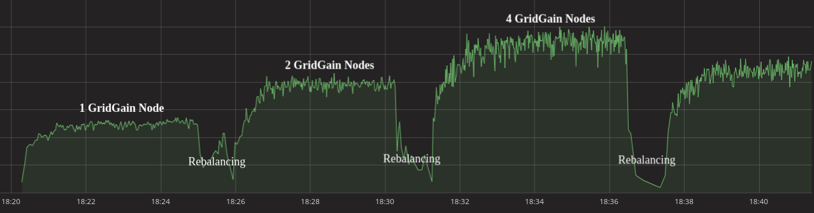

# Highly scalable inference with [GridGain](https://www.gridgain.com/)

- [Overview](#overview)
- [Architecture](#architecture)
- [How to build?](#how-to-build?)
- [How to run?](#how-to-run?)
  *  [Docker Compose](#docker-compose)
  *  [Kubernetes](#kubernetes)
- [Benchmarks](#benchmarks)

## Overview


The initial problem has been taken from Kaggle “Home Credit Default Risk” [problem](https://www.kaggle.com/c/home-credit-default-risk). The following entity relationship diagram describes a data model used in the problem.


This diagram contains so-called “reference data” (files *bureau.csv*, *bureau_balance.csv*, *previous_application.csv*, *POS_CASH_balance.csv*, *instalments_payments.csv*, and *credit_card_balance.csv*) and applications themselves (file *application_{train|test}.csv*). All these tables, including reference data and applications, contains rows so that each row is associated with a single client (or single application what is the same in this context). This fact allows us to use horizontal partitioning (sharding) to store the data in a distributed manner in a cluster.

The goal of the platform is to provide a linearly scalable inference on a trained risk scoring model as well as a production-ready datastore for credit applications and correspondent reference data. The platform provides functionality that allows receiving applications from different sources, making instant predictions about the client’s ability to pay back the credit and saving application together with predicting into distributed datastore.

## Architecture

GridGain is a good choice for such cases. It allows to transparently partition data across nodes in your cluster and provide fault tolerance. In addition to that Apache Ignite is a processing platform and that fact is used to build a highly scalable platform for inference.

The following diagram describes a high-level architecture of the Apache Ignite datastore used to save reference data and applications as well as an inference subsystem.


The following components represented in the diagram:

* **Generator**, which is in charge of the generation of new applications. It represents an input of the system, a source of applications. The goal of the generator is to create applications and send them to Ignite Server Nodes so that prediction could be made there and applications are saved;
* **Ignite Server Node**, which keeps a part of the data distributed across all server nodes and makes inference on received applications. As a result of collocation, all data required for inference is already stored on the node where inference is happening, so inference might be performed instantly without any additional network communications;
* **Application API Layer**, which is responsible for providing a REST API to the data stored on Ignite Server Nodes. The Application API Layer allows getting access to the list of received applications and predictions made for them;
* **User Interface**, allows a client to see applications in Web UI using a Web browser.

The most important part of this architecture is that partitioning, inference and save are made for a single application using a single network call. It allows us to make inference instantly and provide linear scalability.

## How to build?

This project consists of following components: *hc-demo-frontend*, *hc-demo-backend/hc-demo-api*, *hc-demo-backend/hc-demo-generator* and *hc-demo-backend/hc-demo-ignite-server*.

The *hc-demo-frontend* component is a [ReactJS](https://reactjs.org/) application and it could be built using following commands:

```
cd hc-demo-frontend

npm install
npm run build
```

It's also possible to use [Docker](https://www.docker.com/) to build frontend. You can make it using following instructions:

```
cd hc-demo-frontend

docker run -it --rm -v ${PWD}:/app node:7 bash
cd /app
npm install
npm run build
```

All components inside *hc-demo-backend* could be built using [maven](https://maven.apache.org/):

```
cd hc-demo-backend

mvn clean install
```

## How to run?

This repository contains scripts that allow to run demo on a single node using [Docker Compose](https://docs.docker.com/compose/) and in cluster using [Kubernetes](https://kubernetes.io/).

### Docker Compose

To run demo on a single node using Docker Compose it's enough to call the following command:

```
docker-compose up
```

### Kubernetes

This repository contains *hc-demo-kubernetes.yaml* Kubernetes deployment file. If you have a running Kubernetes cluster it's enough to call `kubectl create -f hc-demo-kuberneres.yaml` to deploy the demo into cluster.

If you don't have a running Kubernetes cluster yet the following instruction will help you to set it up using [AWS](https://aws.amazon.com/). The [Kubernetes and Apache Ignite Deployment on AWS](https://www.gridgain.com/resources/blog/kubernetes-and-apacher-ignitetm-deployment-aws) article could be useful as well.

First of all, we need to have following command line utilities: `aws`, `kops` and `kubectl`. The following instruction helps to install them:

* Installation of `aws`:

```
curl "https://s3.amazonaws.com/aws-cli/awscli-bundle.zip" -o "awscli-bundle.zip"
unzip awscli-bundle.zip
sudo ./awscli-bundle/install -i /usr/local/aws -b /usr/local/bin/aws
```

* Installation of `kops`:

```
wget https://github.com/kubernetes/kops/releases/download/1.14.0-alpha.2/kops-linux-amd64
chmod +x kops-linux-amd64
mv kops-linux-amd64 /usr/local/bin/kops
```

* Installation of `kubectl`:

```
export KUBERNETES_PROVIDER=aws
curl -sS https://get.k8s.io | bash
export PATH=$PATH:$PWD/kubernetes/client/bin
```

When all required utilities are installed we need to configure `aws`. AWS Access Key ID and AWS Secret Access Key could be acquired in AWS web console (Account -> My Security Credentials).

```
aws configure
# AWS Access Key ID [None]: XXX
# AWS Secret Access Key [None]: XXX
# Default region name [None]: us-west-1
# Default output format [None]: text
```

After this step we need to configure indetity and access management:

```
aws iam create-group --group-name kops
aws iam attach-group-policy --policy-arn arn:aws:iam::aws:policy/AmazonEC2FullAccess --group-name kops
aws iam attach-group-policy --policy-arn arn:aws:iam::aws:policy/AmazonRoute53FullAccess --group-name kops
aws iam attach-group-policy --policy-arn arn:aws:iam::aws:policy/AmazonS3FullAccess --group-name kops
aws iam attach-group-policy --policy-arn arn:aws:iam::aws:policy/IAMFullAccess --group-name kops
aws iam attach-group-policy --policy-arn arn:aws:iam::aws:policy/AmazonVPCFullAccess --group-name kops
aws iam create-user --user-name kops
aws iam add-user-to-group --user-name kops --group-name kops
aws iam create-access-key --user-name kops
```

Then let's define required environment variables. AWS Access Key ID and AWS Secret Access Key could be acquired in AWS web console (Account -> My Security Credentials).

```
export AWS_ACCESS_KEY_ID=XXX
export AWS_SECRET_ACCESS_KEY=XXX
export NAME=hc-demo-cluster.k8s.local
export KOPS_STATE_STORE=s3://hc-demo-state-store
```

Now we need to create Kubernetes cluster (if you don't have `$HOME/.ssh/id_rsa.pub` key you need to generate it using `ssh-keygen`):

```
kops create cluster --zones eu-west-1a --node-count=6 --node-size=t3.medium --master-size=t3.medium ${NAME} --yes --cloud-labels="team=ml,app=hc-demo"
```

This process takes time. To check current state of the cluster you can use command `kops validate cluster`. When the cluster is ready we can continue.

The next step is deployment of Kubernetes [Dashboard](https://kubernetes.io/docs/tasks/access-application-cluster/web-ui-dashboard/):

```
kubectl apply -f https://raw.githubusercontent.com/kubernetes/dashboard/v1.10.1/src/deploy/recommended/kubernetes-dashboard.yaml
```

To get access to the dashboard we need to generate a token:

```
# Create the service account in the current namespace 
# (we assume default)
kubectl create serviceaccount my-dashboard-sa

# Give that service account root on the cluster
kubectl create clusterrolebinding my-dashboard-sa \
  --clusterrole=cluster-admin \
  --serviceaccount=default:my-dashboard-sa

# Find the secret that was created to hold the token for the SA
kubectl get secrets

# Show the contents of the secret to extract the token
kubectl describe secret my-dashboard-sa-token-xxxxx
```

When it's done we can call `kubectl proxy` and open [http://localhost:8001/api/v1/namespaces/kube-system/services/https:kubernetes-dashboard:/proxy/#!/overview?namespace=default](http://localhost:8001/api/v1/namespaces/kube-system/services/https:kubernetes-dashboard:/proxy/#!/overview?namespace=default).

When all these steps are done we can finally deploy the demo:

```
kubectl create -f hc-demo-kuberneres.yaml
```

After that processes are started and you can access entrypoints (UI and [Grafana](https://grafana.com/)) using links specified in Dashboard in section "Services".

## Benchmarks

Benchmark on a Kubernetes cluster with 4 nodes:


