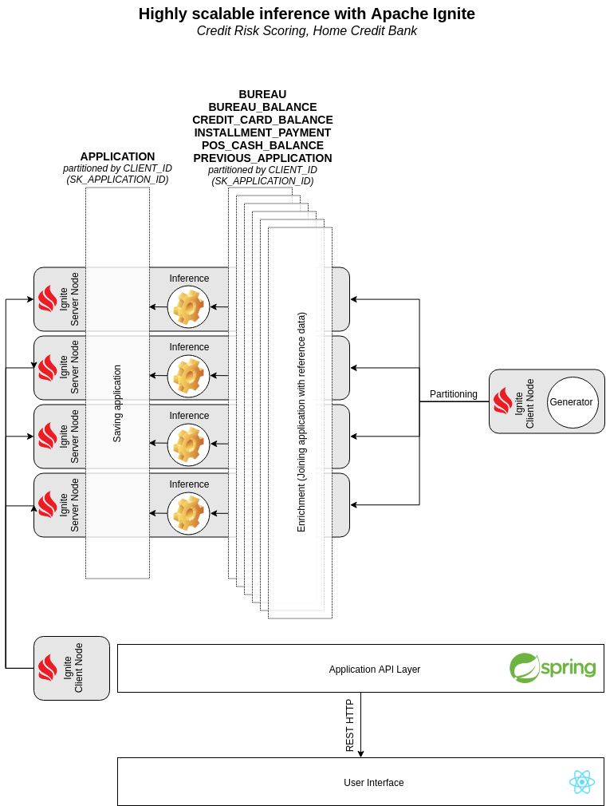

# Highly scalable inference with GridGain

- [Overview](#overview)
- [Architecture](#architecture)

## Overview

The initial problem has been taken from Kaggle “Home Credit Default Risk” [problem](https://www.kaggle.com/c/home-credit-default-risk). The following entity relationship diagram describes a data model used in the problem.


This diagram contains so-called “reference data” (files *bureau.csv*, *bureau_balance.csv*, *previous_application.csv*, *POS_CASH_balance.csv*, *instalments_payments.csv*, and *credit_card_balance.csv*) and applications themselves (file *application_{train|test}.csv*). All these tables, including reference data and applications, contains rows so that each row is associated with a single client (or single application what is the same in this context). This fact allows us to use horizontal partitioning (sharding) to store the data in a distributed manner in a cluster.

The goal of the platform is to provide a linearly scalable inference on a trained risk scoring model as well as a production-ready datastore for credit applications and correspondent reference data. The platform provides functionality that allows receiving applications from different sources, making instant predictions about the client’s ability to pay back the credit and saving application together with predicting into distributed datastore.

## Architecture

GridGain is a good choice for such cases. It allows to transparently partition data across nodes in your cluster and provide fault tolerance. In addition to that Apache Ignite is a processing platform and that fact is used to build a highly scalable platform for inference.

The following diagram describes a high-level architecture of the Apache Ignite datastore used to save reference data and applications as well as an inference subsystem.



The following components represented in the diagram:

* **Generator**, which is in charge of the generation of new applications. It represents an input of the system, a source of applications. The goal of the generator is to create applications and send them to Ignite Server Nodes so that prediction could be made there and applications are saved;
* **Ignite Server Node**, which keeps a part of the data distributed across all server nodes and makes inference on received applications. As a result of collocation, all data required for inference is already stored on the node where inference is happening, so inference might be performed instantly without any additional network communications;
* **Application API Layer**, which is responsible for providing a REST API to the data stored on Ignite Server Nodes. The Application API Layer allows getting access to the list of received applications and predictions made for them;
* **User Interface**, allows a client to see applications in Web UI using a Web browser.

The most important part of this architecture is that partitioning, inference and save are made for a single application using a single network call. It allows us to make inference instantly and provide linear scalability.

## How to build and start?

```
cd hc-demo-backend
mvn clean package

cd ../hc-demo-frontend
npm run build

cd ..
docker-compose build
docker-compose up
```
